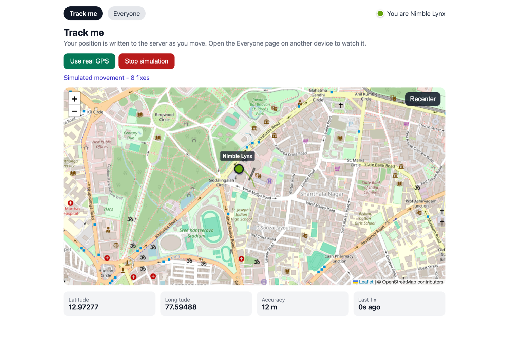
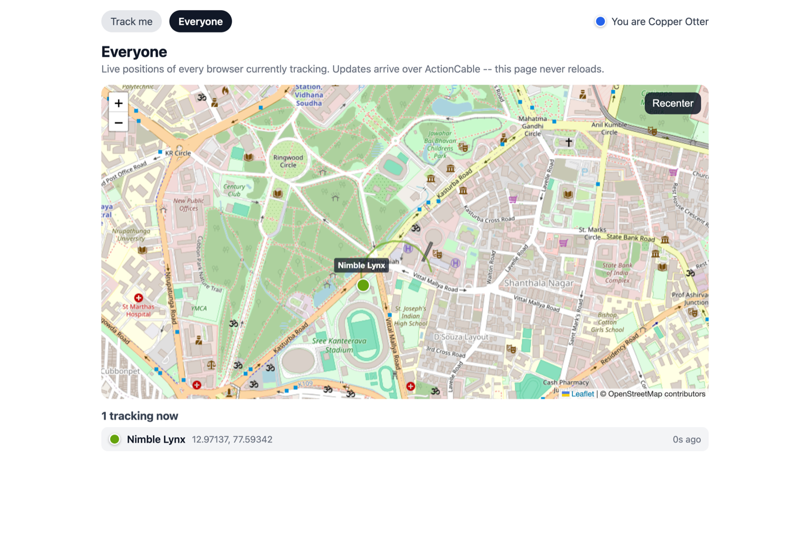

# Livetrack

Live GPS tracking built with **Rails 8 + Hyperstack**. Two pages:

- **`/me` — Track me.** Watches this browser's GPS (`navigator.geolocation.watchPosition`)
  and draws it on a live Leaflet map, writing each accepted fix through HyperModel.
- **`/everyone` — Everyone.** Every browser currently tracking, with markers that move
  in real time over ActionCable. This page never reloads and never polls.

Identity is anonymous: each browser gets a random name and colour on first visit, keyed
by an id in Rails' encrypted session cookie. There is no login and no secret column.




## Running it

```bash
bundle install
bin/rails db:prepare
bundle exec foreman start     # web + Hyperstack hotloader
```

Then open http://localhost:5000. Plain `bin/rails server` also works, but the browser
console will show a failed WebSocket to port 25222 — that is the hotloader, which
`foreman` starts from the `Procfile`.

The first request compiles the Opal bundle and takes ~10s. Subsequent requests are served
from the Sprockets cache.

> **Geolocation needs a secure context.** `localhost` counts, so desktop development works.
> To test from a phone you need HTTPS — a tunnel or a deployed host. Both pages have a
> **Simulate movement** button that walks a synthetic path, which is how the test suite
> drives the app and how you can demo it without moving.

## Tests

```bash
bin/rspec
```

25 specs: request specs (routing, session identity), model specs (scopes, trail pruning,
coordinate validation), and system specs driven through real headless Chrome — including
two-browser specs that assert one session's movement appears on another session's map
without a reload.

`bin/rspec` is a wrapper that resolves a chromedriver matching the installed Chrome
before running, because Selenium Manager prefers a stale driver found on `PATH`.

## Layout

| Path | Purpose |
| --- | --- |
| `app/hyperstack/models/tracker.rb` | Identity + latest fix, denormalised so one row moves one marker |
| `app/hyperstack/models/location.rb` | Trail points, pruned to `TRAIL_LIMIT` per tracker on create |
| `app/hyperstack/components/leaflet_map.rb` | Owns the Leaflet instance; reconciles layers against `markers` |
| `app/hyperstack/components/track_me.rb` | Geolocation watch, throttling, writes |
| `app/hyperstack/components/everyone_map.rb` | Builds markers from `Tracker.live` |
| `app/policies/hyperstack/application_policy.rb` | Public reads; a session may only write its own rows |

Models live in `app/hyperstack/models/` (not `app/models/`) so Zeitwerk loads them on the
server *and* Opal compiles them for the client.

### Design notes

- **Positions are denormalised onto `trackers`.** The everyone map only has to watch one
  row per person to move a marker, which keeps each broadcast small.
- **`tracking` is a boolean, not a time window.** A boolean flips on a real DB write, which
  broadcasts reliably; "seen in the last N minutes" would have to change with no write.
  Staleness is then computed client-side from `last_fix_at` on a 1s ticker, so a browser
  that vanished without a clean stop fades after 60s and drops after 180s with no
  server-side sweeper.
- **Writes are throttled** to at most one per second, and beyond that only on a real
  interval (3s) or a real move (5m) — a stationary phone still emits fixes constantly.
- **`order`/`limit`/`where` are server-only in HyperModel**, so `Tracker.live` is a named
  scope and the per-tracker trail is sorted client-side by `id` (integer comparison,
  which is safer under Opal than comparing `Time`s).

## Rails 8 compatibility notes

Getting this stack onto Rails 8 needed five fixes that are not obvious, four of which fail
*silently*. They are all recorded here because none are specific to this app.

### 1. `opal-rails` cannot be used — use `opal-sprockets`

- `opal-rails` **2.x** hard-caps `rails < 7.3`, so it will not install alongside Rails 8.
- `opal-rails` **3.x** allows Rails 8 but replaced the Sprockets integration with an
  `app/opal` → `app/assets/builds` build step. Hyperstack's `//= require hyperstack-loader`
  needs Sprockets to compile `.rb`/`.rb.erb` through Opal at request time, which 3.x no
  longer does. Its own `LegacyUpgradeWarning` tells you to pin to the 2.0 series.

`opal-sprockets` is the same Sprockets integration with **no Rails dependency at all**
(just `sprockets ~> 4.0` and `opal < 2.0`), so it works on Rails 8. See
`config/application.rb`, which requires `opal/sprockets` and appends `Opal.paths` to
`config.assets.paths`.

Rails 8 also dropped `rails new --asset-pipeline=sprockets`, so this app was generated with
`--skip-asset-pipeline` and wires `sprockets-rails` plus `app/assets/config/manifest.js`
by hand.

### 2. `json` must stay on 2.x

Rails 8.0's `ActiveSupport::JSON` calls `JSON.generate(.., quirks_mode: true)`, a keyword
`json` 3.0 removed. Ruby 3.4 ships `json` 3.x as a default gem, so any `to_json` — including
the one `react_component` uses to serialise props — raises
`unknown keyword: quirks_mode`. Pinned to `< 3.0` in the `Gemfile`.

### 3. `connection_pool` must stay on 2.x

`react-rails` 2.7.1 builds its prerender pool with `ConnectionPool.new(options_hash)`, but
`connection_pool` 3.0 made `#initialize` keyword-only. `React::ServerRendering.reset_pool`
runs from the railtie at boot even with prerendering off, so this breaks boot outright.

### 4. `ApplicationRecord.primary_abstract_class` breaks the client bundle

`hyperstack:install` generates an `app/hyperstack/models/application_record.rb` that calls
`primary_abstract_class`. HyperModel's client-side `ActiveRecord::Base` does not implement
it and does not list it in `SERVER_METHODS` (its ignore-list for server-only macros), so on
the client it raises `called class method missing` — which aborts the Opal bundle and leaves
**every component silently unmounted**. This app guards it with `RUBY_ENGINE == "opal"` and
uses `self.abstract_class = true` there.

*Worth fixing upstream:* adding `:primary_abstract_class` to hyper-model's `SERVER_METHODS`
would make the installer's own generated file work out of the box.

### 5. Real-time sync is silently off under RSpec — `Hyperstack.on_server?`

```ruby
def self.on_server?
  defined? Rails::Server
end
```

That is only true when the app was booted by `rails server`. Under RSpec, Capybara boots the
app in the *test* process, so `on_server?` is false and `ReactiveRecord::Broadcast.after_commit`
takes its `send_to_server` branch — an HTTP round trip to `Connection.root_path` wrapped in
`rescue nil`. No `ActionCable.server.broadcast` is ever emitted and every real-time assertion
fails with no error anywhere. `spec/rails_helper.rb` redefines `on_server?` to `true`, which
is what hyper-spec does in its own `before(:each)`.

`config/cable.yml` also uses the `async` adapter in **test**, not `:test` — the `:test`
adapter captures broadcasts instead of delivering them.

## Opal interop notes

Two things here cost real debugging time and generalise to any Hyperstack + JS-library work.

**HyperModel attribute values arrive as boxed JS objects.** They behave correctly in Ruby,
but `typeof` is `'object'`, not `'number'`/`'string'`. Leaflet's `toLatLng()` checks
`typeof a[0] !== 'object'` and silently returns `null` for a boxed pair, so
`L.marker(...)._latlng` ends up null and `addTo()` then throws
`Cannot read properties of null (reading 'lat')`. Values straight from a browser API (the
geolocation callback) are already primitives, which is why this only bit the page rendering
synced data. `LeafletMap#num`/`#str` coerce at the boundary.

**A not-yet-loaded attribute is a truthy `DummyValue`.** It reports `nil? == true`,
`is_a?(Numeric) == false`, and `to_s == ''`. So:

- Guard on type (`is_a?(Numeric)`), not truthiness, before handing coordinates to Leaflet.
- `Time.now - last_fix_at` raises `no implicit conversion of DummyValue into Integer`;
  `Tracker#seconds_since_fix` checks `stamp.nil?`, which catches both real nil and DummyValue.
- Anything drawn imperatively must be **reconciled on update**, not just on create — a marker
  built before its columns load would otherwise keep an empty colour and label forever.

Also: Opal compiles unary `!x` to `Opal.not(x)`, which reads `x['$!']`. On a raw DOM node
(from `ref:`) that throws. Use `if`/`unless`, which compile to `$truthy` and handle natives.
